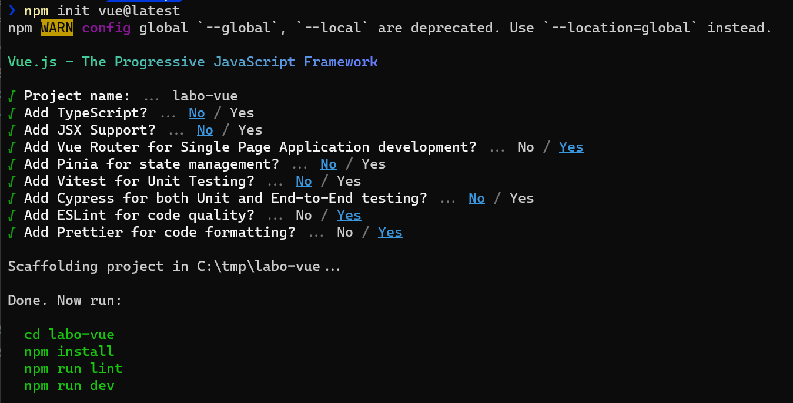

summary: Getting Started with Vue.js Project Setup
id: vue-dev-setup
categories: Web
tags: vuejs
status: Published
authors: Boris Fritscher
feedback link: https://github.com/bfritscher/cours-pweb-slides

# Getting Started with Vue.js Project Setup


## Getting Started

In this lab we will setup a new local Vue.js project with the Vite build tool.

<aside class="negative">
Older version of Vue used Vue CLI, but this is no longer recommended.
</aside>

<aside class="positive">
Looking for more? More details in the official <a href="https://vuejs.org/guide/quick-start.html">Vue.js Guide</a>
</aside>


## Install Development Environment Prerequisites

Download and install [Node.js](https://nodejs.org/) to get `npm`.

Download and install [Git](https://git-scm.com/download/win) to get `git`.

Download and install [Visual Studio Code](https://code.visualstudio.com/) to get `code`.


Check that it works from the shell:

```sh
$ git --version
git version X.Y.Z

$ node --version
vX.Y.Z

$ code --version
X.Y.Z
...
x64
```


## Create a new project

First change to a parent folder in which the project folder will be created.


Use vue/vite to create a new project.

```sh
C:\temp> npm init vue@latest
```

### Select your preferred options



## Install Extensions for VS Code

Change into the directory and launch vscode
```sh
$ cd labo-vue
$ code .
```

### Install recommended extensions

#### VS Code
- [vscode Vue Volar extension](vscode:extension/Vue.volar)
- [vscode Prettier extension](vscode:extension/esbenp.prettier-vscode)
- [vscode eslint extension](vscode:extension/dbaeumer.vscode-eslint)

#### Chrome
- [vue chrome devtool extension](https://chrome.google.com/webstore/detail/vuejs-devtools/nhdogjmejiglipccpnnnanhbledajbpd)


## Install Project Dependencies

<aside class="negative">
Must be done inside the project's root folder!
</aside>

```sh
$ npm install
```

This will read `package.json` and update `node_modules` folder.


## Preview Your App in The Browser


Start the development server
```sh
npm run dev
```
<aside class="positive">
Edit a file and watch livereload in action.
</aside>

For example in `./index.html` add:

```
<h1>Test vue!</h1>
<!-- inside <body> -->
```

<aside class="positive">
Stop the server with <i>ctrl+c</i>
</aside>


## Cleanup

We want to simplify the starting project for now

- Delete `src/assets/base.css`
- Empty  `src/assets/main.css`
- Replace `src/App.vue` with this code:

```html
<template>
  <div class="container">
    <h1>Hello Bootstrap</h1>
    <div class="row">
      <div class="col-sm">
        <button class="btn btn-primary">{{ message }}</button>
      </div>
      <div class="col-sm">
        <i class="fas fa-ice-cream display-1 text-primary"></i>
      </div>
    </div>
  </div>
</template>

<script>
export default {
  data() {
    return {
      message: "Hello Vue!",
    };
  },
};
</script>

<style></style>
```

## Add Bootstrap and Font Awesome

Bootstrap is a CSS Gird and Component library.

Font Awesome provides a large number of free icons.

Check `package.json` (before and after)

1. Add dependencies

```sh
$ npm install --save bootstrap @popperjs/core
$ npm install --save @fortawesome/fontawesome-free
```

<aside class="positive">
Save is important because it will add an entry to the package.json.
This allows to reinstall all the project's required dependencies with npm install.
</aside>


2. Inside `src/main.js` add imports

```javascript
import "bootstrap";
import "bootstrap/dist/css/bootstrap.min.css";
import "@fortawesome/fontawesome-free/css/all.min.css";
```


## Try More Font Awesome

Check that the icon works:


### Add another icon to the `App.vue`

```html
<i class="fa-solid fa-cake-candles"></i>
```

<aside class="positive">
Looking for more? More icons on <a href="https://fontawesome.com/icons">https://fontawesome.com/icons</a>
</aside>


## Use npm to install other packages

Lets try another bootstrap look.

```sh
npm install bootswatch --save
```

<aside class="positive">
Looking for more? More themes on <a href="https://bootswatch.com/">https://bootswatch.com/</a>
</aside>

### Try different CSS files from bootswatch in `main.js`

```javascript
import "bootswatch/dist/darkly/bootstrap.min.css";
```

<aside class="positive">
Did you notice the live-reload of the local server?
</aside>


## Test linting

We installed two linter to help use follow best practice in code formatting and quality:

- Prettier for code formatting
- ESLint for code quality

Run the command and check how the files are changed.

```sh
$ npm run lint
```

Copy this line into `main.js` and see what happens.

```js
let myvar = 'Hello World'
```

<aside class="positive">
What are all the errors?<br/>
Check the PROBLEMS tab of vscode
(right-click to fix problem).
</aside>

### You now have a fully working project and know how to install dependencies and how to write clean code.
