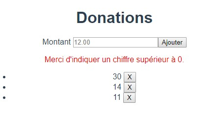
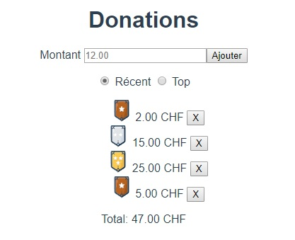
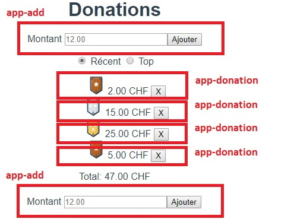
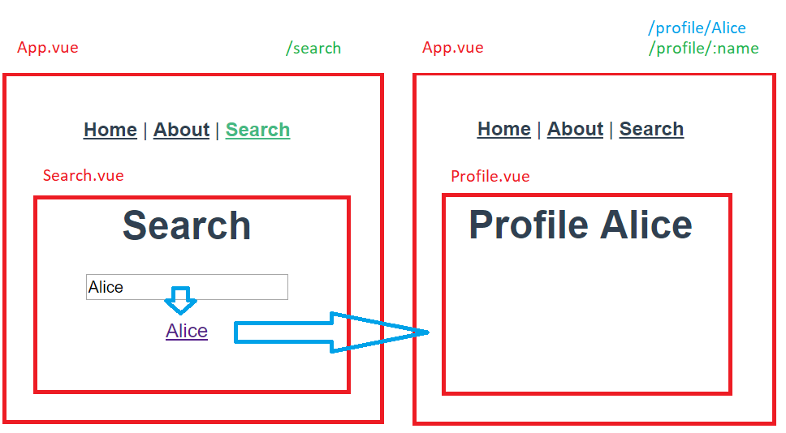
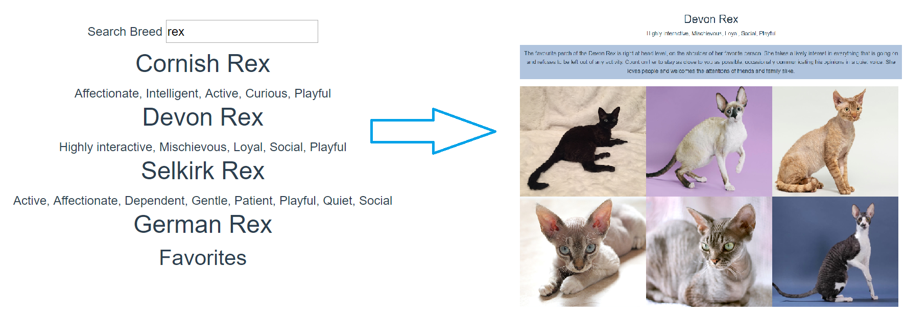

summary: Vue.js Exercices
id: vue-exercices
categories: Web
tags: vuejs
status: Published 
authors: Boris Fritscher
feedback link: https://github.com/bfritscher/cours-pweb-slides

# Vue.js Exercices

## Exercice Vue.js: model, if, for
Editer App.vue pour créer la page suivante :

<!-- .element: class="w-30" -->

<!-- .element: class="center box" -->

- Cliquer sur « Ajouter » ajoute le montant qui se trouve dans l’input à une liste en dessous.
- Si le montant n’est pas supérieur à 0 il faut indiquer un message d’erreur, autrement le message est caché.
- On peut effacer un élément de la liste avec le bouton « X »

<!-- .element: class="small" -->


## Exercice Vue.js: computed and methods
Editer App.vue pour créer la page suivante (avec des computed et des methods):

<!-- .element: class="w-30" -->

<!-- .element: class="center box" -->

- Récent ou Top filtre la liste selon les dernier ajouté d'abord ou de valeur décroissante.
- L'affichage des montants est tranformé pour toujours afficher 2 chiffres après la virgule et CHF.
- Ajouter une image du niveau: level 1 jusqu'à 10 level 2 jusqu'à 20 puis 3.
```https://gistcdn.githack.com/bfritscher/6ff8e74b80d44616944843fe83cc5d19/raw/2d4e25748fbbe681681932444a7ef339c90d4dde/chevron_${level}.svg```

<!-- .element: class="smaller" -->


## Exercice Vue.js: components
Transformer (Refactor) l'application en composant selon:

<!-- .element: class="w-40" -->

<!-- .element: class="center box" -->

- Créer une fonction reutilisable toChf() qui retourne un nombre formaté en chf.
- Ajouter, transformer le code, pour que l'application fonctionne encore de la même façon.

<!-- .element: class="small" -->


## Exercice Vue.js: transitions

Ajouter des effets de transitions au message et à la liste:

<!-- .element: class="w-40" -->

<!-- .element: class="center box" -->


## Exercice Vue.js: localStorage

Persister les données localement

- Sauvegarder dans le localstorage la liste à chaque fois que celle-ci change.
- Au chargement de la page, s'il y a une liste sauvegardé dans le localstorage, alors récupérer cette valeur.


## Exercice Vue.js: router

Remplacer `createWebHistory` avec `createWebHashHistory` dans `src/router/index.js`

Ajouter deux pages supplémentaires pour créer ceci:

<!-- .element: class="w-50" -->

<!-- .element: class="center box" -->


## Exercice Vue.js: router

- Un lien principal Search,
- Une page Search qui génère dynamiquement l'attribut `to` d'un `<router-link>` selon le texte d'un input.
- Une page Profile qui affiche le nom du paramètre de l'URL.

<!-- .element: class="w-50" -->

<!-- .element: class="center box" -->


## Exercice Vue.js: axios
Transformer le projet précédent pour utiliser le site thecatapi.com:

<!-- .element: class="w-80" -->

<!-- .element: class="center box" -->


## Exercice Vue.js: axios

- Entrer du texte dans la boîte de recherche affiche une liste de Breeds
- Cliquer sur un élément de la liste amène à une page détaille.
- La page détaille utilise le code id de la Breed récupérer en tant que paramètre d'URL pour rechercher 6 photos de cette race.


